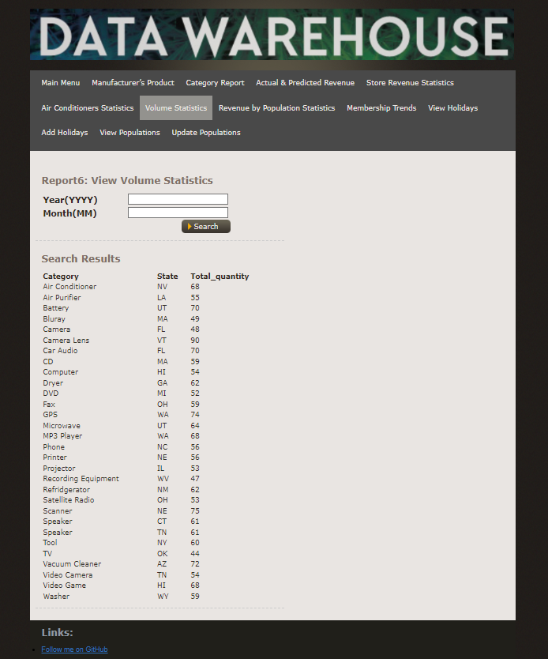

# pricepalace-data-warehouse
An  internal data warehouse display platform

## Settings of environment variables
Inside the project root directory, there should be a .env file, which is used to set up the password for MySQL database of the root user.

`MYSQL_ROOT_PASSWORD = your_password`


Inside the `lib` directory, there should be a php.env file, in which there should be a password used to connect to the MySQL database. The password is the same as what  you have set in the .env file.

```
<?php

  global  $DB_PASS;
  $DB_PASS = "your_password";

?>
```

## Database

MySQL database is used in the project. You should first create the `pricepalace` database. Then, you should create the data tables needed for the project. The schema of the data tables is shown in `create_tables_schema`. After this, you could insert corresponding data to the database.

## How to run this website

Make sure you have installed Docker in your machine. Then, run the command below, and you can get the project set up on your local machine.

```bash
$ docker-compose up --build
``` 

## A screenshot of the website



